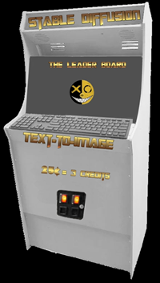

# automatic1111-arcade

<table><tr><td>

</td><td>

</td></tr></table>

<table><tr><td>

</td><td>

</td></tr></table>

<table><tr><td>

</td><td>

</td></tr></table>

<table><tr><td>

</td><td>

</td></tr></table>

<table><tr><td>

</td><td>

</td></tr></table>

<table><tr><td>

</td><td>

</td></tr></table>

An app written in VB6 and C++ for Windows 11 that runs as a legacy Kiosk and intends to be a coin operated Text-to-Image Arcade setup using Stable Diffusion Automatic1111 API (on localhost, without internet nor mouse).

Users put in 0.25 cents and get 3 credits.  Each image generated costs 2 credits, and to vote on any one generated image to be in the top 12 is 1 credit.

The following Automatic1111 extensions are involved/supported:
stable-diffusion-webui-auto-tls-https	https://github.com/papuSpartan/stable-diffusion-webui-auto-tls-https.git
stable-diffusion-webui-nsfw-censor	https://github.com/AUTOMATIC1111/stable-diffusion-webui-nsfw-censor.git

The main application is written in Visual Basic 6, Visual C++ 6, Python 3.10.6 and requires "Microsoft ActiveX Data Objects 2.8 Library" for a Microsoft Access 97 database that it stores everything (you can get with MDAC\_TYP.EXE). The two supporting C++ DLL's I did not write, their sources are included in this repository (and were/are available on the internet which is where I acquired them).  One of which is Redirect.DLL, it allows Visual Basic 6 to open console applications (not visible) and read/write to console apps i.e. programmable "cmd.exe."  The second DLL is inpout32.dll (and the 64bit version inpoutx64.dll) which is an API interface used to read and write to the data IO logics of a parallel port for this application to hardware detect a coin box's switch when a coin is put in it.

IF YOU INTEND TO TRY TO RUN THIS PROGRAM, PLEASE READ THE COMPILE CONDITIONS COMMENTS IN THE SOURCE CODE CAREFULLY AS IT IS POSSIBLE TO LOCK YOURSELF OUT OF THE SYSTEM LEAST THE POWER BUTTON AVAILABLE FOR RECOVERY TO BE USED.

The application runs as a Windows Shell with all restrictions necessary to be a public Kiosk with a keyboard.  In a full production environment (inside a coin operated arcade box housing) auto logon to a password-less administrator account is the only thing that does not setup with the code
and would be required to boot it straight into the shell.  Just ask CoPilot "What are the registry entries used to auto login to a password-less account on Windows 11?"

CoPilot basically wrote most the Visual Basic 6 registry module and the Txt2Img2Txt.py Python.